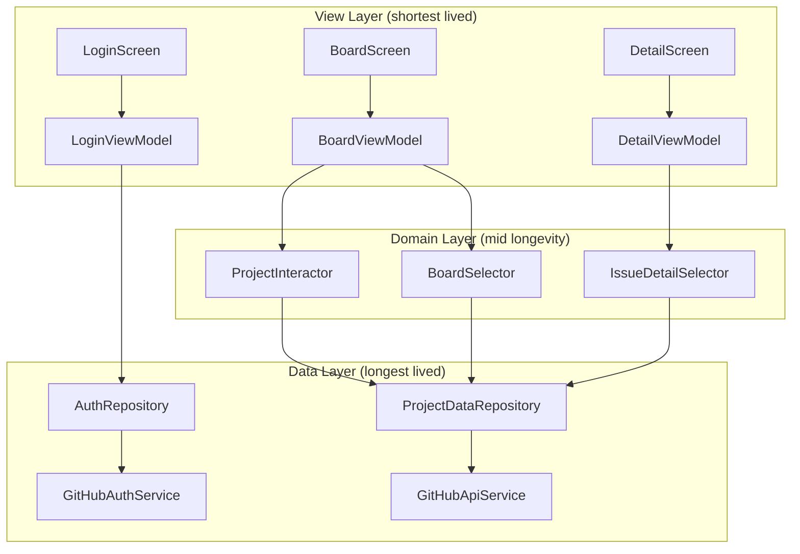
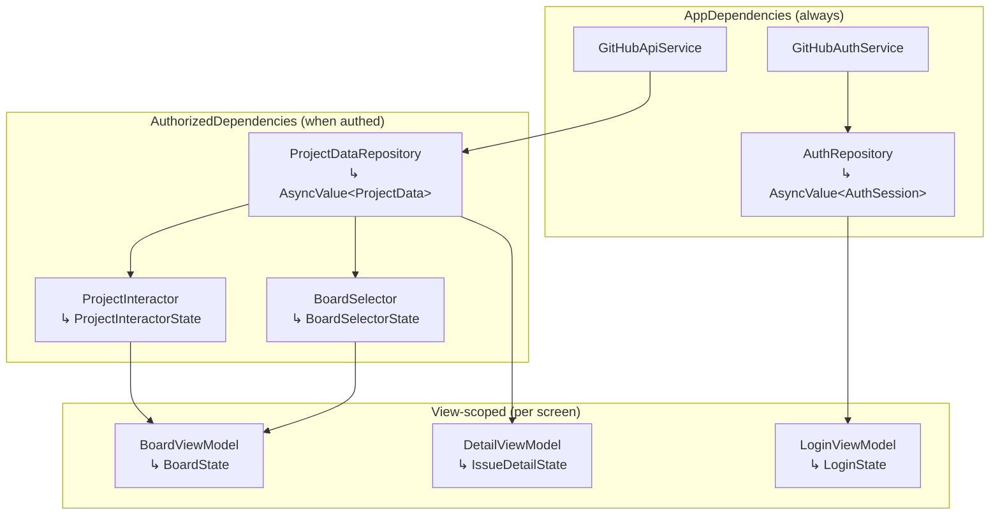
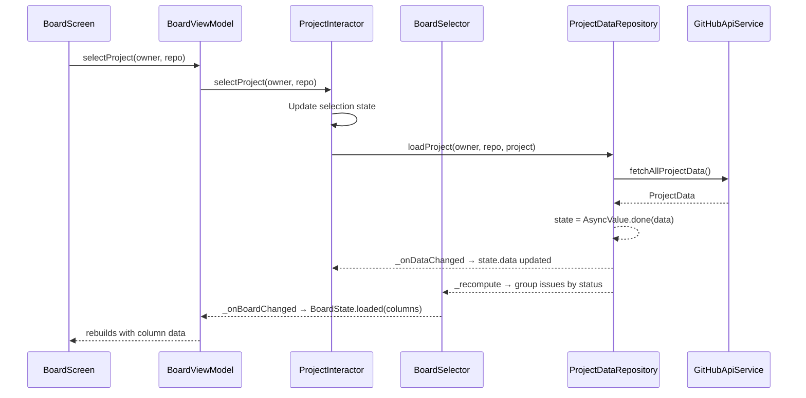

# Big Top — Architecture: Data Flow

## Architecture (predictable-flutter)

Three layers organized by longevity. Dependencies point down (view → domain → data).



## Provider Tree



## Data Flow: Board



## Dependency Rules

| Component | Can depend on | Cannot depend on |
|-----------|--------------|-----------------|
| Service | External packages, platform APIs | Anything internal |
| Repository | Services it wraps | Other repos, domain, view |
| Interactor/Selector | Repo state (read), repo methods (mutate), services | Other domain observables |
| ViewModel | Interactors, selectors, repositories | Services directly |
| View | Its ViewModel | Everything else |

## File Structure

```
lib/
├── app/                    ← DI wiring, router, theme
├── core/                   ← AsyncValue, shared primitives
├── auth/
│   ├── models/             ← AuthSession
│   ├── repositories/       ← AuthRepository
│   ├── services/           ← GitHubAuthService
│   ├── viewmodels/         ← LoginViewModel
│   └── screens/            ← LoginScreen
├── board/
│   ├── interactors/        ← BoardSelector
│   ├── viewmodels/         ← BoardViewModel
│   ├── screens/            ← BoardScreen
│   └── widgets/            ← IssueCard, StatusColumn
├── project/
│   ├── models/             ← ProjectData, Issue, Comment, Label, Dependency, Event
│   ├── repositories/       ← ProjectDataRepository
│   ├── services/           ← GitHubApiService
│   └── interactors/        ← ProjectInteractor
└── detail/
    ├── interactors/        ← IssueDetailSelector
    ├── viewmodels/         ← DetailViewModel
    └── screens/            ← DetailScreen
```
