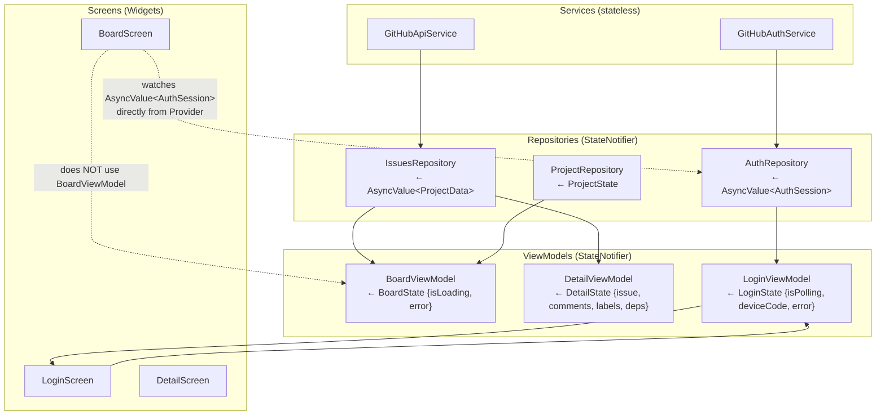
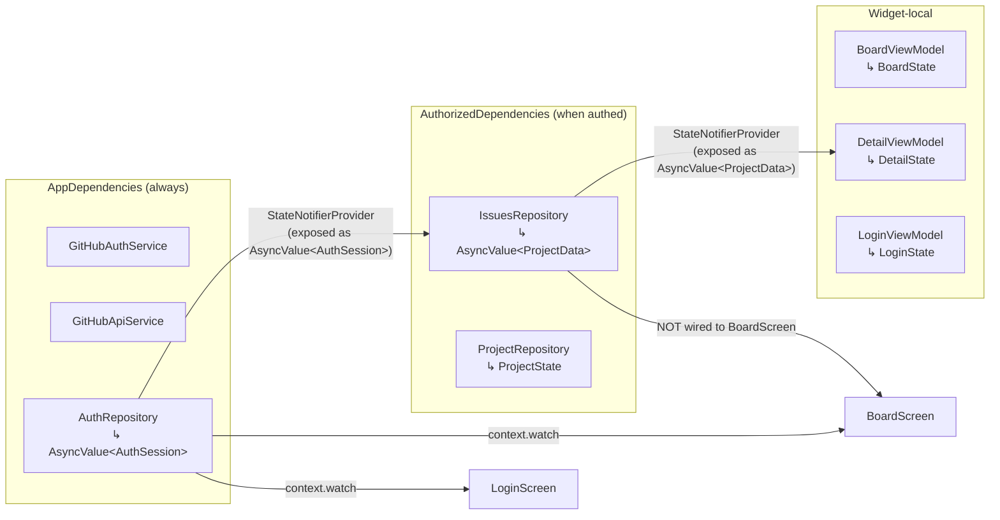
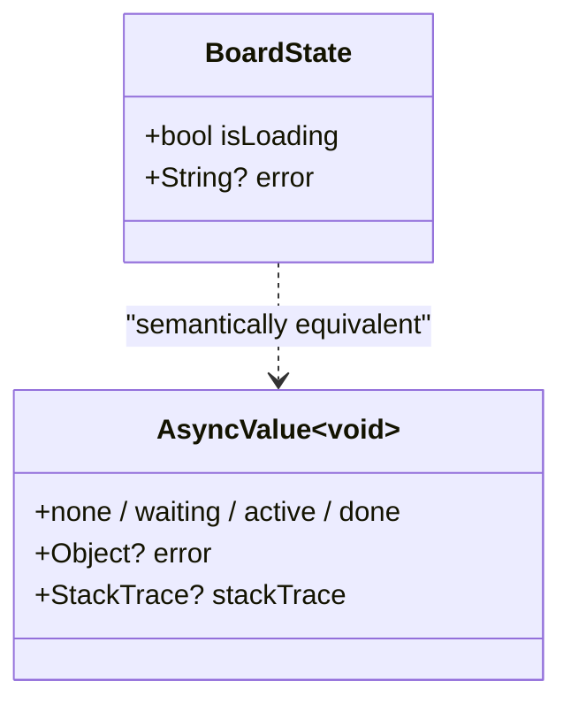
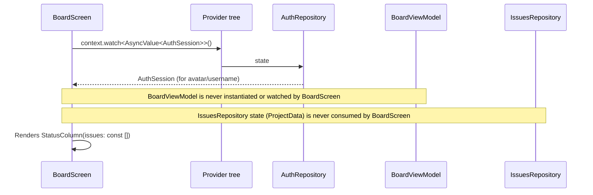
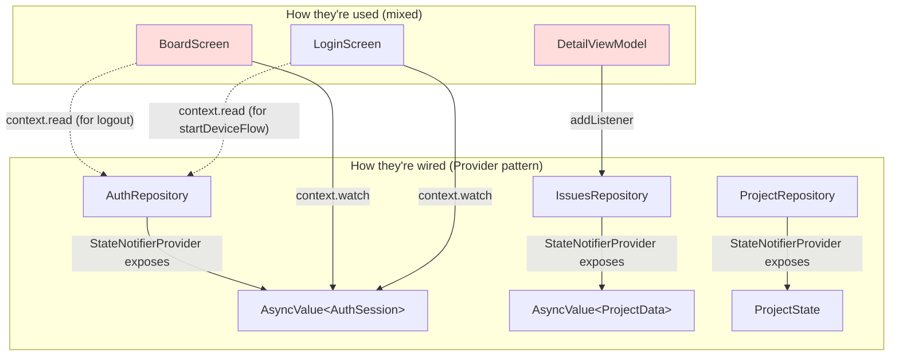
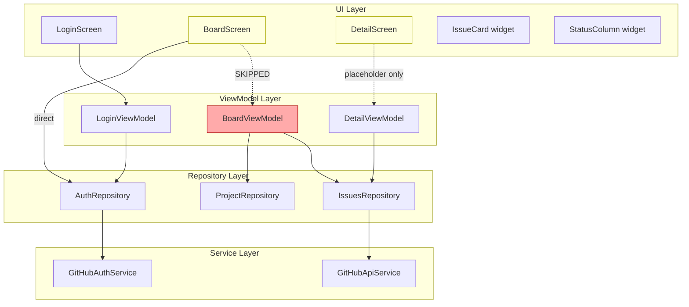

# Big Top — Architecture: Data Flow

## Current Dependency Graph

Who creates whom, who depends on whom.

## State Ownership

Which `StateNotifier` owns which state, and how the widget tree accesses it.

## The Problems

### 1. `BoardState` ≈ `AsyncValue<void>`

`BoardState` tracks `{isLoading, error}` — that's exactly what `AsyncValue<void>` represents. It carries no actual board data. The `BoardViewModel` calls `_issuesRepo.loadProject()` but never exposes `_issuesRepo.state` (the `AsyncValue<ProjectData>`) to the UI.

### 2. `BoardScreen` bypasses its ViewModel

The board screen watches `AuthRepository` directly for the user avatar, but passes `const []` for issues. `BoardViewModel` exists but is orphaned — nothing instantiates it in the widget tree.

### 3. Repository ≠ Provider (incomplete rename)

Screens sometimes `watch` the _exposed state type_ and sometimes `read` the _repository instance_ to call methods. `DetailViewModel` bypasses Provider entirely and uses `addListener` directly on the `IssuesRepository` instance. There's no consistent pattern.

## Layer Map (current)

**Legend:**
- 🔴 Red = orphaned / unused
- 🟡 Yellow = partially wired / placeholder UI
